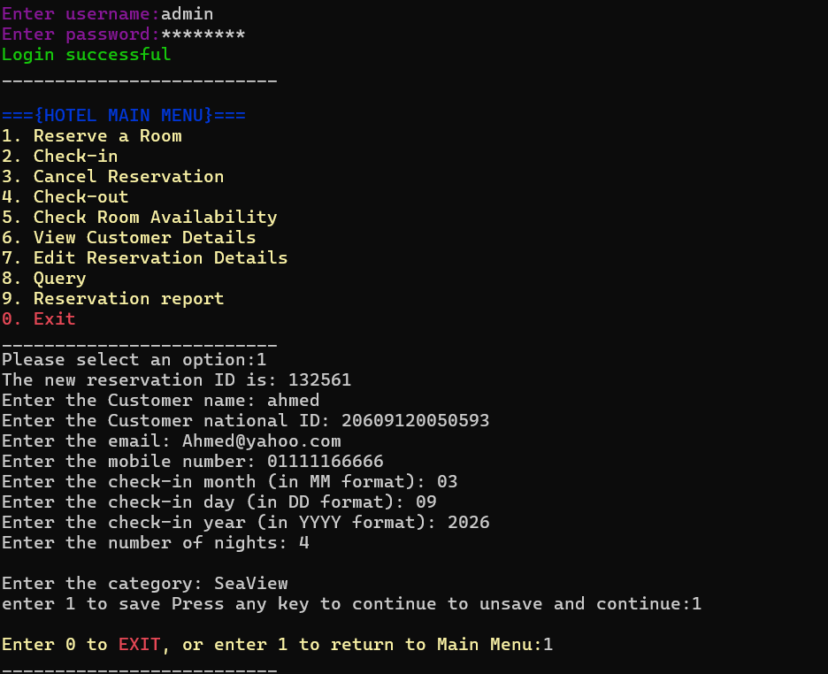
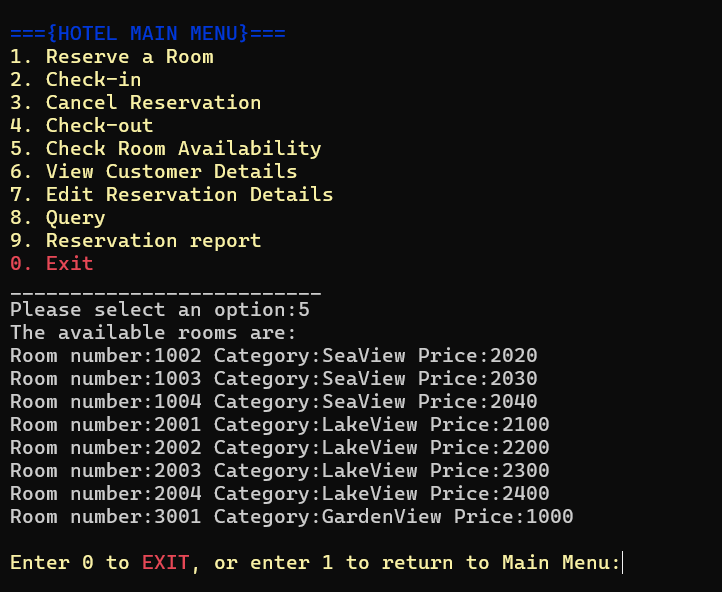
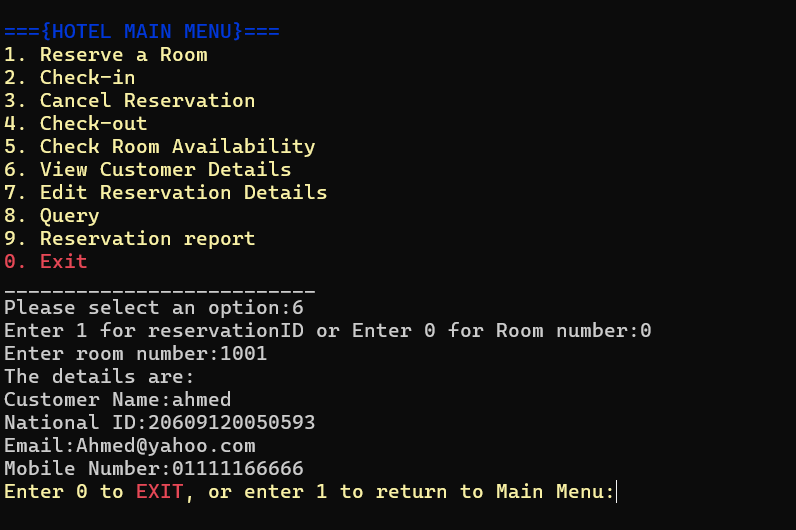
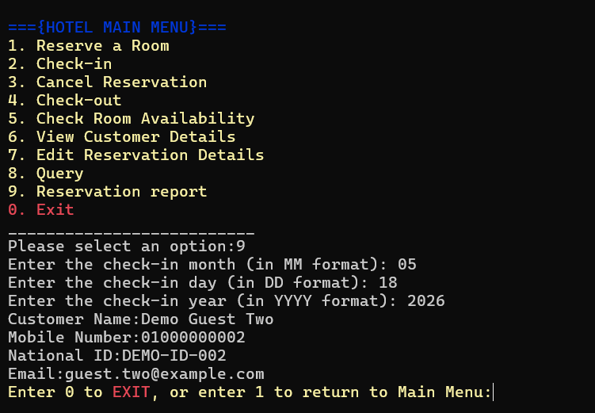
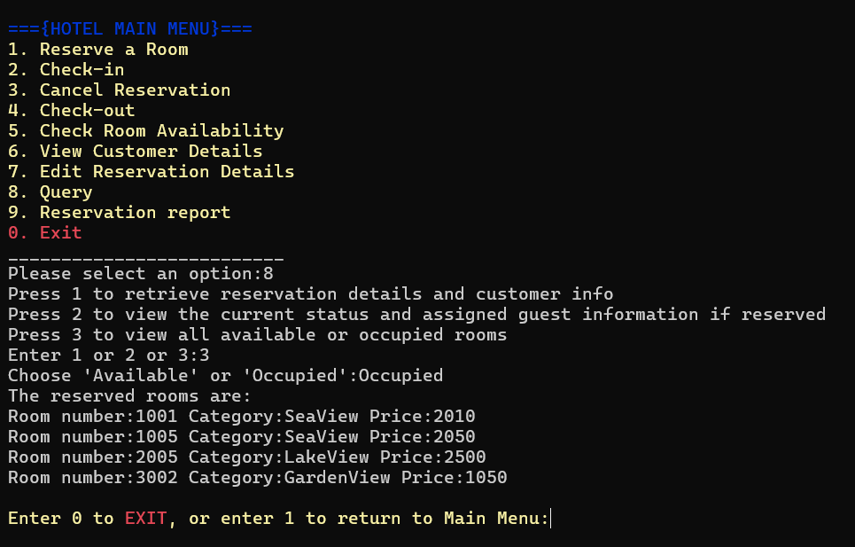
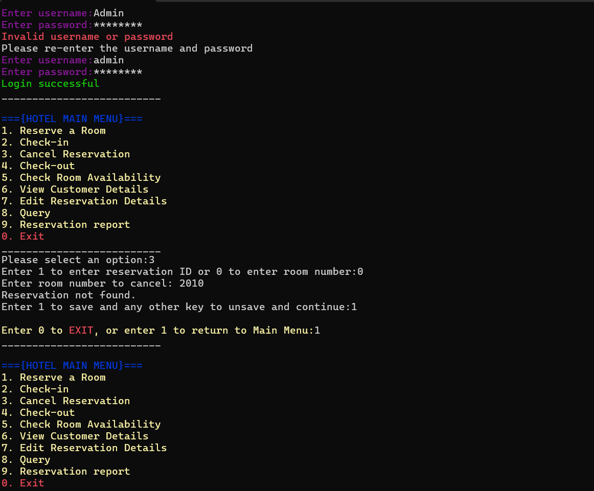

# Hotel Reservation System in C

A C-based console hotel reservation management system built using structured programming and file handling. The project simulates core hotel operations such as user login, room reservation, check-in, check-out, cancellation, customer lookup, room availability, and reservation reporting.

## Project Overview

This project was developed to practice C programming fundamentals through a complete menu-based console application. It focuses on file handling, structs, arrays, validation, and managing records through text files.

The system allows hotel staff to log in, manage room reservations, check customer details, update reservation status, view available rooms, and generate reservation reports.

## Features

- User login system
- Password masking in console
- Room reservation
- Check-in workflow
- Check-out workflow
- Reservation cancellation
- Room availability checking
- Customer details search
- Reservation editing
- Reservation query options
- Reservation report by date
- File-based storage using text files
- Colored console interface on Windows

## Technologies Used

- C
- File handling
- Structs
- Console-based UI
- Windows console functions
- Git and GitHub

## Project Structure

```text
hotel-reservation-system-c/
│
├── hotel_reservation_system.c     Main C source code
├── rooms.txt                      Room data
├── reservations.txt               Reservation data
├── users.txt                      Login user data
├── screenshots/                   Application screenshots
├── .gitignore
└── README.md
```

## Demo Login

Use the following demo account:

```text
Username: admin
Password: admin123
```

## Main Functionalities

### Authentication

The system starts with a login screen where users enter a username and password. The password is masked while typing.

### Main Menu

After successful login, the user can access the main hotel menu:

- Reserve a Room
- Check-in
- Cancel Reservation
- Check-out
- Check Room Availability
- View Customer Details
- Edit Reservation Details
- Query
- Reservation Report
- Exit

### Room Reservation

Allows the user to create a new reservation by entering customer information, check-in date, number of nights, and room category.

### Room Availability

Displays available rooms with room number, category, and price.

### Customer Details

Allows searching for customer information using reservation ID or room number.

### Reservation Report

Generates reservation information based on a selected check-in date.

### Query System

Provides filtering and lookup options for reservation information.

## Screenshots

### Reserve Room



### Room Availability



### Customer Details



### Reservation Report



### Hotel Query



### Cancel Reservation



## How to Run the Project

### Windows Recommended Method

This project uses Windows-specific console libraries such as:

```c
windows.h
conio.h
```

So it is intended to run on Windows.

You can run it using:

- Code::Blocks with MinGW
- Dev-C++
- Visual Studio with suitable C configuration
- MinGW-w64 through terminal

### Compile Using GCC

If GCC is installed and added to PATH, run:

```bash
gcc hotel_reservation_system.c -o hotel_reservation_system.exe
```

Then run:

```bash
hotel_reservation_system.exe
```

Or in PowerShell:

```powershell
.\hotel_reservation_system.exe
```

## Data Files

The project uses text files for storage:

| File | Purpose |
|---|---|
| `users.txt` | Stores login credentials |
| `rooms.txt` | Stores room number, status, category, and price |
| `reservations.txt` | Stores reservation and customer records |

These files must remain in the same directory as the executable/source file for the system to work correctly.

## What I Learned

- Building a complete console application in C
- Using structs to organize related data
- Reading from and writing to text files
- Managing room and reservation records
- Implementing login logic
- Creating a menu-based user interface
- Handling customer records and reservation workflows
- Cleaning and publishing a C project professionally on GitHub

## Future Improvements

- Improve input validation
- Replace text files with a database
- Improve file reading logic
- Add clearer error handling
- Make the code cross-platform by removing Windows-only dependencies
- Improve naming consistency across functions and variables
- Add modular header/source files
- Add automated tests for reservation logic

## Author

Youssuf Hatem Fathalla